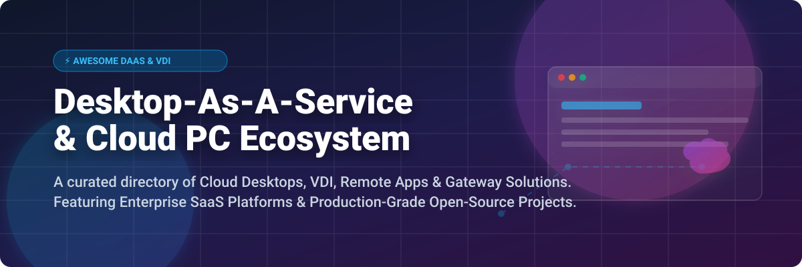

  

# 💻 Awesome Desktop-As-A-Service (DaaS) & Cloud PC Ecosystem 🚀

  
  
  
  
  

> **Curated List of SaaS Products & Open-Source GitHub Projects for Desktop-as-a-Service (DaaS), Virtual Desktop Infrastructure (VDI), Application Streaming & Remote Desktop Access.**

---

## 💡 Overview & Introduction

This repository tracks notable enterprise **SaaS DaaS platforms** and production-grade **open-source VDI/remote desktop projects**. Desktop as a Service (DaaS) enables organizations to deliver virtual desktops, hosted desktop environments, application streaming, and secure browser workspaces to any device over the web—centralizing IT management, improving data security, and empowering remote/hybrid workforces.

Whether you are evaluating cloud PC solutions like **Amazon WorkSpaces** and **Windows 365**, or setting up self-hosted open-source gateways like **RustDesk**, **Apache Guacamole**, and **Kasm Workspaces**, this list provides verified details on features, pricing, free tiers, and company backings.

---

## 📖 Table of Contents

- [☁️ SaaS/Hosted DaaS Platforms](#%EF%B8%8F-saashosted-daas-platforms)
- [🔓 Open-Source GitHub Projects](#-open-source-github-projects)
- [🤝 How to Contribute](#-how-to-contribute)
- [💖 Support & Sponsorship](#-support--sponsorship)
- [⭐ Star History](#-star-history)
- [⚠️ Disclaimer](#%EF%B8%8F-disclaimer)

---

## ☁️ SaaS/Hosted DaaS Platforms

> **📊 Market Context & Industry Dynamics**: The global Desktop-as-a-Service (DaaS) market is estimated at **~$8 Billion in 2026** and projected to reach **~$25 Billion by 2032** at a **~20% CAGR**. The sector is **moderately concentrated** — market leaders like **Amazon (AWS WorkSpaces)** and **Microsoft (Azure Virtual Desktop & Windows 365)** lead cloud DaaS adoption alongside enterprise VDI titans **Citrix DaaS** and **Omnissa Horizon Cloud**, while specialized cloud-native providers (e.g. Dizzion Frame, Kasm Cloud) address targeted high-performance and browser-based virtualization requirements.

Below is a comparison table of commercial DaaS platforms, sorted by **Company Size (Revenue / Valuation)** in descending order:

| Platform | Description | Pricing (Starting Tier) | Free Tier Limits | Company Size (Revenue / Valuation) 🔽 |
|:---|:---|:---|:---|:---|
| **[Amazon WorkSpaces](https://aws.amazon.com/workspaces/)** 🚀 | **AWS-managed persistent & non-persistent DaaS.** WorkSpaces Personal delivers persistent desktops; WorkSpaces Pools provides shared auto-scaling desktops. | **$25.00/user/month** (Windows Value bundle: 1 vCPU, 2 GB RAM) or **$7.50/month base + $0.22/hour** (AutoStop). | **AWS Free Tier**: 200 hours/month of WorkSpaces Personal for 2 months (1 vCPU, 2 GB RAM). | **~$638 Billion revenue** (Amazon FY2025) |
| **[Azure Virtual Desktop](https://azure.microsoft.com/en-us/products/virtual-desktop/)** ☁️ | **Microsoft's cloud VDI platform.** Multi-session Windows 10/11, RemoteApp streaming, and granular Azure compute scaling. | **~$20.00/user/month** estimated infrastructure cost (Pay-as-you-go Azure compute/storage; no extra license cost for M365 E3/E5). | **Azure Free Account**: $200 free credit for 30 days + 12 months of select free cloud services. | **~$281 Billion revenue** (Microsoft FY2025) |
| **[Windows 365 (Cloud PC)](https://www.microsoft.com/en-us/windows-365)** 💻 | **Persistent Cloud PC with simplified per-user monthly billing.** One-user, one-desktop model deeply integrated with Microsoft 365, Entra ID, and Intune. | **$28.00/user/month** (Business Basic: 2 vCPU, 4 GB RAM, 128 GB storage) or **$36.00/user/month** (Standard: 2 vCPU, 8 GB RAM). | **30-Day Free Trial** (Includes 1 license of Windows 365 Business Standard for 30 days). | **~$281 Billion revenue** (Microsoft FY2025) |
| **[Citrix DaaS](https://www.citrix.com/)** 🏢 | **Enterprise-grade VDI and application streaming.** Hybrid cloud deployment, advanced HDX user experience protocol, and granular security policy engine. | **$15.00/user/month** (Citrix DaaS Premium / Hybrid starting quote tier; requires minimum user commit). | **14-Day Enterprise Free Trial** available upon request with proof of corporate domain. | **~$3.2 Billion revenue** (Cloud Software Group) |
| **[Omnissa Horizon Cloud](https://www.omnissa.com/)** 🌐 | **Enterprise VDI platform (formerly VMware Horizon).** Multi-cloud management stack, Blast Extreme protocol, and dynamic app delivery. | **$11.50/user/month** (Horizon Cloud subscription base tier; cloud infrastructure costs separate). | **60-Day Evaluation Trial** available via enterprise sales contact. | **~$1.5 Billion revenue** (Independent entity spun out of VMware/Broadcom) |
| **[Dizzion Frame](https://www.dizzion.com/)** 🖼️ | **Cloud-native DaaS & App Streaming.** Delivers Windows/Linux desktops and apps directly via HTML5 browser across AWS, Azure, GCP, or Nutanix. | **$20.00/user/month** (Frame Concurrent / Named User starter tier + cloud infrastructure cost). | **30-Day Free Trial Test Drive** (Includes 50 hours of free browser session time). | **~$50 Million+ raised** (Private VC-backed) |
| **[Kasm Cloud](https://kasm.com/)** 🔒 | **Managed Workspaces-as-a-Service.** Browser-delivered containerized apps, desktops, and Zero Trust isolated web browsing with SOC 2 Type II compliance. | **$5.00/user/month** (Kasm Cloud Professional Plan) or free self-hosted Community Edition. | **14-Day Free Trial** on Kasm Cloud; **Perpetual Free** Community Edition (up to 5 concurrent sessions) for self-hosting. | **Private Bootstrapped** (Kasm Technologies) |

---

## 🔓 Open-Source GitHub Projects

The open-source DaaS and remote virtualization ecosystem is exceptionally mature and production-proven. Below are the top open-source projects, sorted by **GitHub Star Count** in descending order:

| Repo / Project | Description | GitHub Stars 🔽 |
|:---|:---|:---:|
| **[RustDesk](https://github.com/rustdesk/rustdesk)** 🦀 | **Full-featured open-source remote control & desktop access platform.** Self-hosted with full data sovereignty. Supports Windows, macOS, Linux, iOS, Android, and Web. Features VP8/VP9/AV1 codecs, P2P connection with NaCl end-to-end encryption. |  |
| **[Apache Guacamole](https://github.com/apache/guacamole)** 🥑 | **De-facto clientless HTML5 remote desktop gateway.** Provides clientless access to RDP, VNC, and SSH protocols through any standard web browser—no client plugins required. |  |
| **[Apache CloudStack](https://github.com/apache/cloudstack)** ☁️ | **Infrastructure-as-a-Service (IaaS) platform widely used for VDI multi-tenancy.** Manages compute, storage, and networking for scale-out virtual desktop workloads without expensive hypervisor licensing. |  |
| **[Proxmox VE](https://github.com/proxmox/pve-manager)** 🦁 | **Open-source enterprise server virtualization platform.** Integrates KVM hypervisor and LXC containers. Frequently paired with Kasm Workspaces and IsardVDI for enterprise desktop orchestration. |  |
| **[Remmina](https://github.com/FreeRDP/Remmina)** 🖥️ | **Remote desktop client written in GTK+ for Linux.** Supports RDP, VNC, SPICE, SSH, and WWW protocols with multi-monitor support and encrypted connection profiles. |  |
| **[FreeRDP](https://github.com/FreeRDP/FreeRDP)** 🔑 | **Free implementation of the Remote Desktop Protocol (RDP).** Core protocol engine powering many clientless and native remote desktop solutions across Windows, Linux, and macOS. |  |
| **[Kasm Workspaces](https://github.com/kasmtech/workspaces-issues)** 🛡️ | **Containerized Desktop-as-a-Service & Browser Isolation.** Streams Docker container desktops/apps to browsers with GPU acceleration, Zero Trust OpenZiti integration, and Proxmox VE auto-provisioning. |  |
| **[IsardVDI](https://github.com/isard-vdi/isard)** 🐧 | **Free Software desktop virtualization platform (AGPL v3).** KVM-based VDI with NVIDIA GPU pass-through/vGPU support, Docker Compose deployment, and web UI for SPICE/noVNC/RDP sessions. |  |
| **[QVD (theqvd)](https://github.com/theqvd/theqvd)** 📦 | **Open-source VDI solution tailored for Linux desktops.** Delivers lightweight virtualized Linux desktop sessions and applications to distributed organizations. |  |

---

## 🤝 How to Contribute

Contributions are welcome and greatly appreciated! Help us keep this list comprehensive and up to date:

1. 🍴 **Fork** this repository.
2. 📝 **Add/edit** entries in `README.md` maintaining alphabetical or star-based sorting.
3. 📌 **Include**: Product name, official link, factual 1-2 sentence description, pricing, and free tier details.
4. 🚀 **Submit** a Pull Request with a clear description of your additions.

Before submitting, check out our curated list collection at [Awesome-Awesome-Awesome](https://github.com/ishandutta2007/Awesome-Awesome-Awesome).

---

## 💖 Support & Sponsorship

If you find this Desktop-as-a-Service & Cloud PC directory useful, please consider supporting the project:

- ⭐ **Star** this repository on GitHub to increase its visibility.
- 🔄 **Share** it with fellow IT administrators, DevOps engineers, and Cloud architects.
- ☕ **Buy me a coffee / Sponsor** the maintainer via [GitHub Sponsors](https://github.com/sponsors/ishandutta2007).

Thank you for supporting open-source software and transparent technology documentation! ❤️

---

## ⭐ Star History

---

## ⚠️ Disclaimer

- This list is **community-curated** for informational and research purposes only — it is not exhaustive and does not constitute an endorsement.
- DaaS and remote desktop platforms process sensitive enterprise data. Always implement Zero Trust network access, multi-factor authentication (MFA), and compliance controls before deploying solutions in production.
- Pricing figures and free tier details are verified against public documentation as of October 2026, but vendor pricing schedules are subject to change.

---

  <b>Made with ❤️ for IT administrators, VDI engineers, cloud architects, and system integrators.</b>

